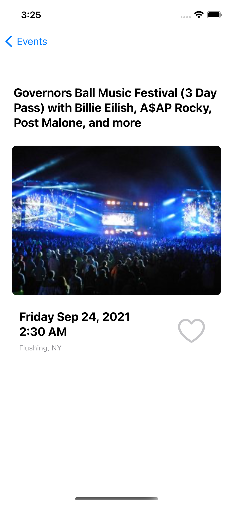
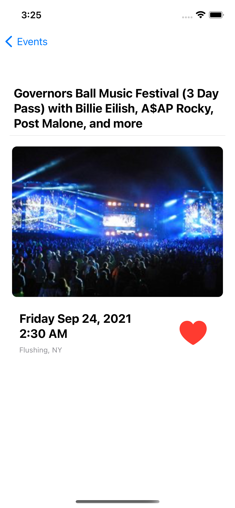

# Fetch (FetchRewards)

A SwiftUI app that displays events from the SeatGeek API (https://
platform.seatgeek.com/)

## How to use
Please open and run the ```Fetch.xcworkspace``` file to view the project. 

## Features

- Follows MVVM (Model-View-ViewModel) design pattern.
- Combine Framework used to make a reactive search bar.
- Uses Alamofire to fetch an array of JSON event data.
- Uses SwiftyJSON to parse data down into an Event object array.
- Uses SDWebImageSwiftUI to async load and cache images.
- Events can be favorited/unfavorited and are saved locally to the device.
- Event ID's are stored in UserDefaults for data persistence.
- UTC to EST Date Formatter.

## App Screenshots





## Dependency Manager

[Cocoapods](https://cocoapods.org/)

### Dependencies

- [SDWebImageSwiftUI](https://github.com/SDWebImage/SDWebImageSwiftUI)
- [Alamofire](https://github.com/Alamofire/Alamofire)
- [SwiftyJSON](https://github.com/SwiftyJSON/SwiftyJSON)

### To reinstall pods on Apple M1*

```bash
sudo arch -x86_64 gem install ffi
arch -x86_64 pod install
```
